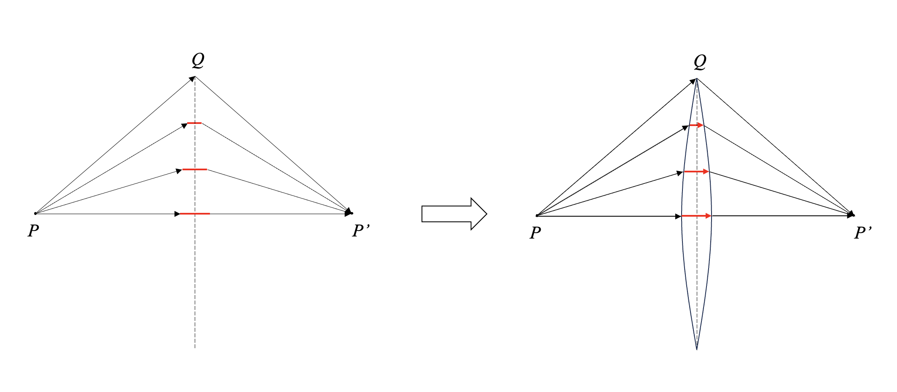
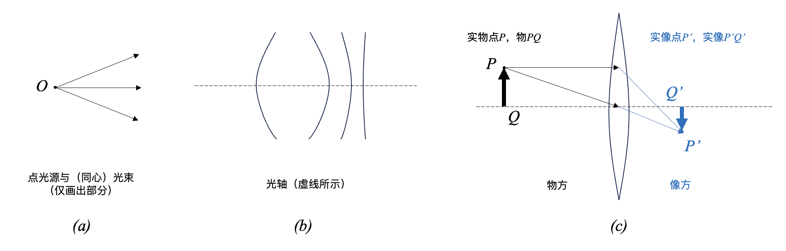
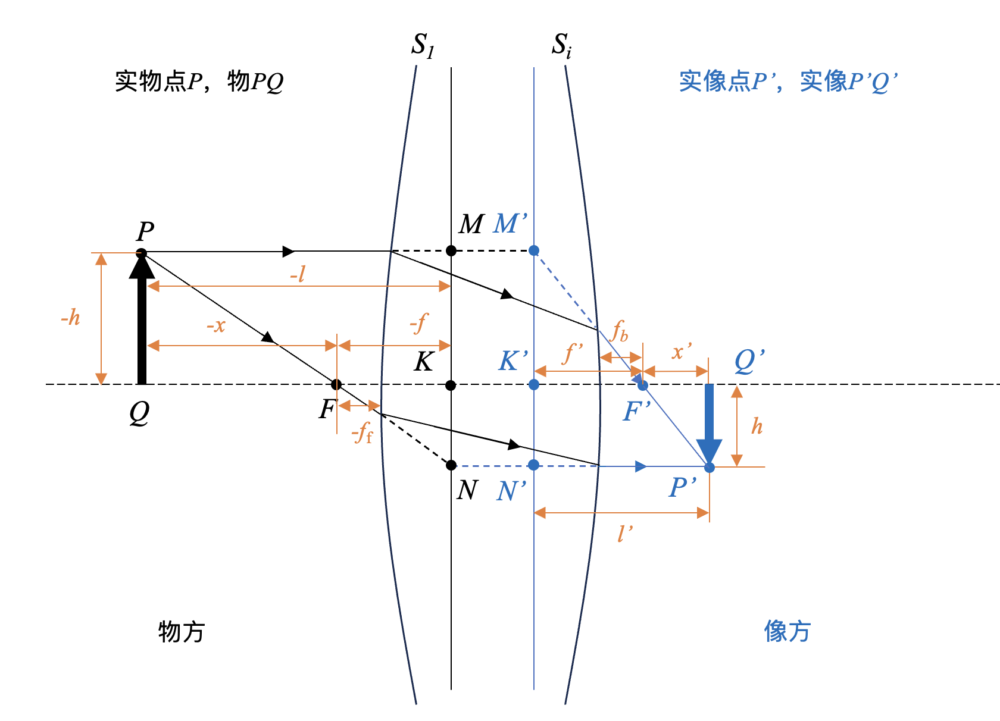
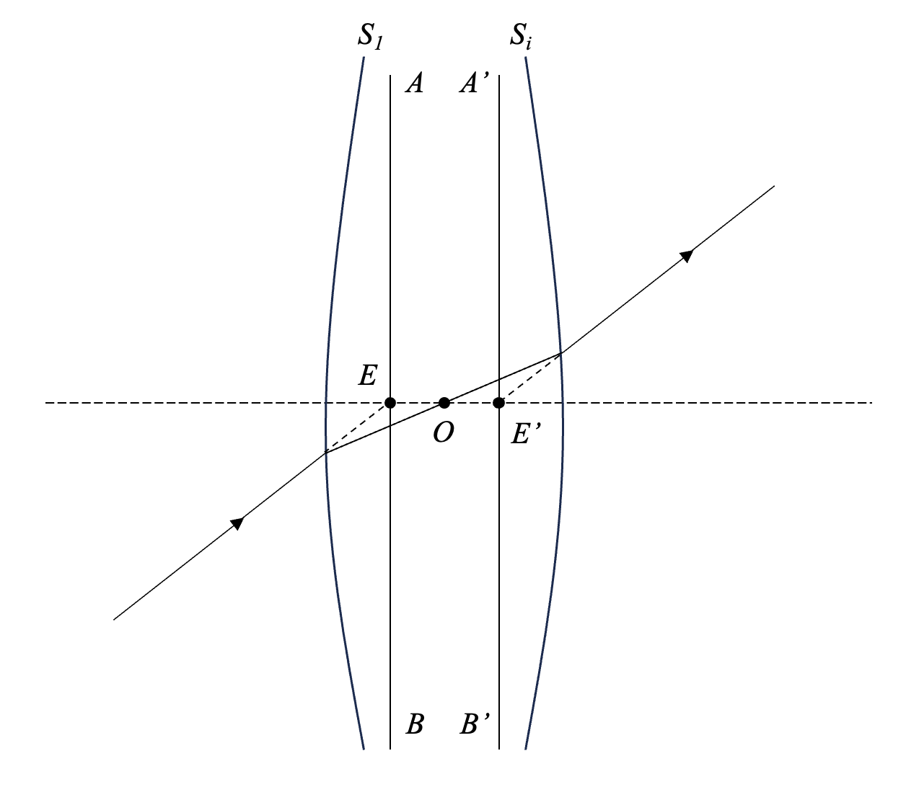
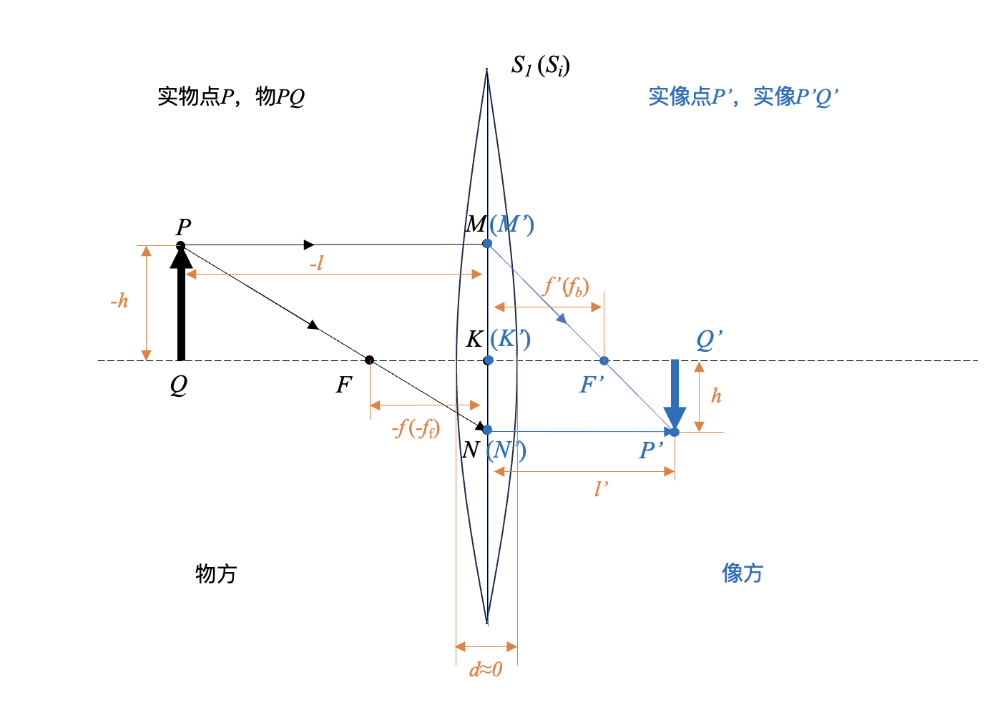
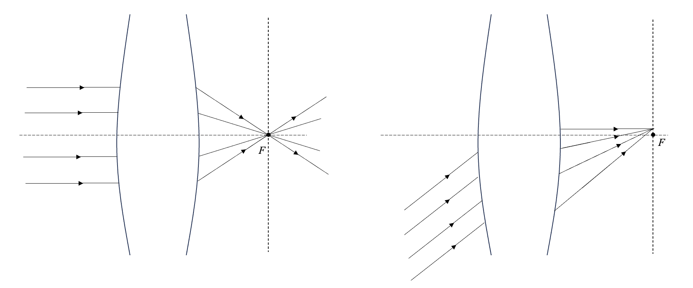
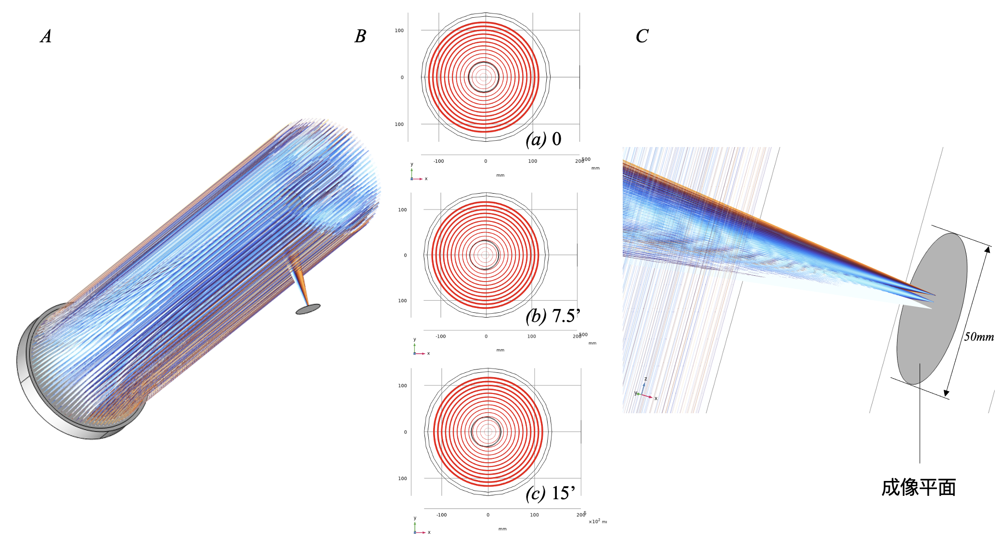
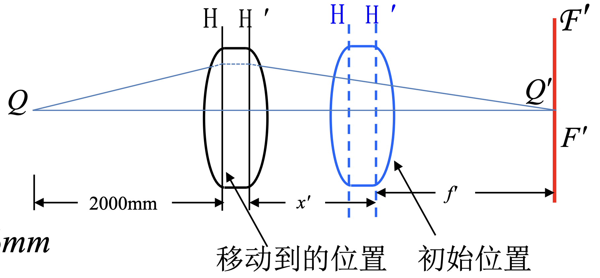
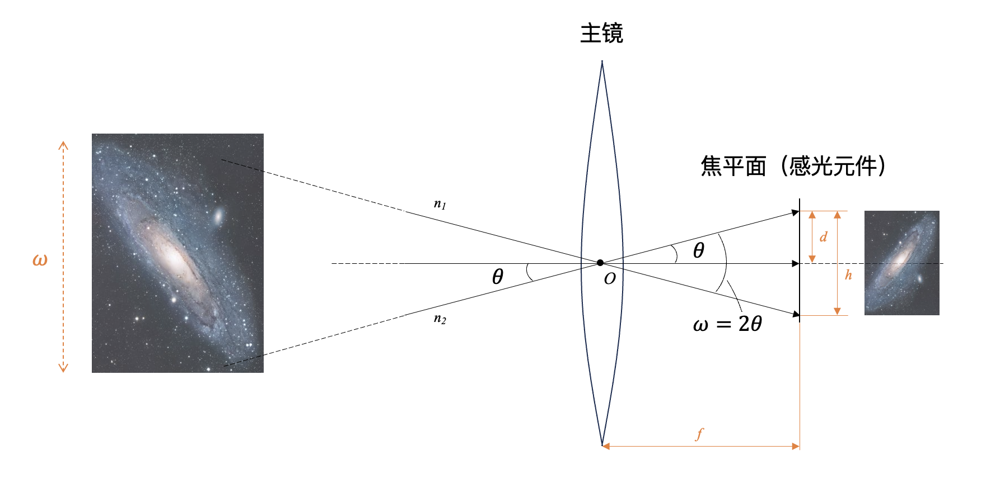

# 第一节 几何光学基础

谈及光，大家脑袋里第一个想到的可能就是一些箭头和直线，看着亮着的电脑屏幕，啊，这就是光线射进了我的眼睛。如果说是在天文摄影里边，那就是光线进入了我的望远镜，再经过折射、反射之类的，最后射到光电传感器上，啊，这就是我拿到的图像。

这就是所谓的几何光学，它将 **光近似为所谓光线(Ray of light)** ，来研究光在透明介质中的传播规律以及成像规律。我们最熟悉不过的就是几何光学的三大定律：

* 光的直线传播定律：光在均匀介质中沿直线传播；
* 光的反射与折射定律：光在两种介质的界面改变传播方向的规律；
* 光的独立传播规律：光线在不同方向相交，不影响每一光线的传播。

这些定律的具体内容就不再阐述了，是初中物理的内容。有一点需要提及的是费马原理，因为它是描述光线传播规律的基本原理，以此为基础可以导出上述的基本定律。

## 1 费马原理

### 1.1 折射率和光程

在了解费马原理之前，首先需要复习一下折射率和光程的概念。

**折射率** (Refractive index, Index of refraction)：

* 绝对折射率：光在真空中的传播速度与光在该种介质中的传播速度之比。显然，根据此定义，真空中的折射率为1。公式表示为：

    $$  n = \frac{c}{v} $$

    其中，$c$为真空中的光速，$v$为介质中的光速。

* 相对折射率：两种介质之间的折射率之比。

    $$  n_{12} = \frac{n_2}{n_1} $$

    其中，$n_1$为第一种介质的折射率，$n_2$为第二种介质的折射率。

**光程** (Optical path)：光在介质中传播的距离与介质折射率的乘积。如果均匀介质的折射率为 $n$ ，光在介质中的传播距离为 $s$ ，则光程为 $ns$ 。不难推出，光程其实与相同时间内光线在真空中传播的距离相等。所以，光程和光的传播时间在物理上是等效的，可以说是光传播所需时间的另一种表达。

光程在很多外国教材上会表示为 $OPL$ ，可用公式表示为：

$$ OPL = \int_{P}^{Q} n(s)ds = \int_{P}^{Q} \frac{c}{v} ds = c \Delta t$$

### 1.2 费马原理

那么费马原理是啥呢？

有很多光学书上将费马原理表述为“在从空间中一点到另一点的所有可能路径中，光传播的实际路径是需时最短的路径“。当然这个表述并不是很严谨。更确切地说，费马原理应该是指 **两点间光的实际路径，是光程平稳（取极值）的路径** 。所谓光程平稳路径，就是如果我们稍稍给路径一个极小的扰动，光程的一阶导数为0。关于如何解释费马原理，需要用到量子光学的知识，大概是说光实际的传播路径对应光子几率波叠加干涉的最大方向，在这里就不详细展开了。

$$ \delta \int_{P}^{Q} n(s)ds = 0 $$

看到这里你可能会想，“啊？为什么突然提费马原理？这玩意和我们天文摄影有啥关系？”。费马原理可以看作是光传播规律的一个基本原理，你可以用它推导之前提及的几何光学三大定律、推导会聚透镜的光路和基本形状、推导反射式望远镜镜面设计基础——圆锥曲线光学特性等。因此，了解这个概念，有助于加深对几何光学和光学系统比较本质的光学特性的理解。

???+ note "利用费马原理推导会聚透镜的光路和基本形状"
    {: .small}

    图1 利用费马原理推导会聚透镜的光路和基本形状

    如图1，假设我们放置一个光学元件，能使得所有从 $P$ 点发出的光线都可以汇聚到 $P'$ 点。由费马原理可知，光总是沿着平稳路径传播。也就是说，从 $P$ 到 $P'$ 点的所有路径都是平稳路径；因此，光沿这些路径传播的光程是相同的。但是很显然，如果我们什么都不加的话， $PQP'$ 的几何距离明显比 $PP'$ 长。所以，我们可以在 $PP'$ 路径上增加一定厚度的透明介质，比如玻璃，使得红色线段处光程增加，来“补偿”一定的光程；并且越靠近透镜中心，需要“补偿”的光程越多；这样就可以使 $PP'$ 的光程与 $PQP'$ 相等。于是我们就得到了这样一个中间厚两边薄的会聚透镜以及其光路。

## 2 光学系统与成像概念

通过几何光学的基本定律来理解成像与光学系统是比较轻松的，因为我们很容易想象其光路图。比如说我们在初中就学习到的不用镜头就用小孔就能成像的小孔成像。因此，我们可以从简单的几何光学出发，了解一些光学系统及成像的基本概念。

* 光学系统是指由一系列透镜、反射镜等光学元件以一定排列方式组合而成的系统，其主要目的为成像；比如天文望远镜就是典型的光学系统。
* 成像可以理解成，对于接收到的光信息进行一次变换，得到像的过程。

为了之后讨论方便，复习一些其他的基本概念包括：

* 点光源：当发光体的尺寸与发光距离相比可以忽略不计时，可以将该物体看成理想化的点光源；
* 实物点与实像点：实际光线经过的物点为实物点，实际光线经过的像点为实像点；
* 虚物点与虚像点：实际光线的反向延长线经过的物点称为虚物点；实际光线的反向延长线经过的像点称为虚像点；
* 实像与虚像：实像点的集合就是实像，虚像点的集合就是虚像。实像由于是实际真有光线经过，所以可以用人眼观测，接收屏、感光元件等接收；但是虚像仅仅是因为光的直线传播导致的人眼错觉，并没有实际光线经过，所以只能用人眼观测到；
* 物点所在的空间称为物空间（或者物方），像点所在的空间称为像空间（或者像方）；
* 光束：在空间中具有一定关系的光线的集合；
* 同心光束(concentric beam)：或者称为单心光束(homocentric beam)，指光线本身或者其延长线交于一点；
* 光轴：通过光学系统各表面曲率中心的直线。

{: .small}

图2 成像与光学系统概念图示

## 3 理想光学系统

我们印象里最多的恐怕就是如图2 $(c)$ 所示的光学系统：对于点光源 $P$ 发出的光线，经过光学系统后所有的出射光线都会交于 $P'$ 点；我们只需要该点发出的两条特定光线，就可以确定对应像点的位置。这个其实就是 **理想光学系统** 。虽然这个系统实际上并不存在，但是因为这个系统计算比较简单，光线追迹的复杂程度低，因此我们可以在这个系统下再深入了解一些概念。

{: .small}

图3 理想光学系统的物象关系

* $S_{1}$ 和 $S_{i}$ ：分别表示理想光学系统的第1个和第 $i$ 个面（最后一个表面）
* $K$ ：物方主点；
* $K'$ ：像方主点；
* $MN$ ：物方主平面；
* $M'N'$ ：像方主平面；
* $F$ ：称为前焦点、物方焦点或者第一焦点，是平行光从右向左穿过光学系统产生的焦点；
* $F'$ ：称为后焦点、像方焦点或者第二焦点，是平行光从左向右穿过光学系统产生的焦点。过 $F'$ 作垂直于光轴的平面，该平面为像方焦平面。
* $f$ ：物方焦距，即物方主点到物方焦点的距离；
* $f'$ ：像方焦距，即像方主点到像方焦点的距离。如果光学系统物空间和像空间的介质折射率相同，则 $f = f'$ 。如果这一光学系统处于空气中，则此时的像方焦距又称为有效焦距(Effective Focal Length)。
* $f_{b}$ ：光学系统的后焦距(Back Focal Length)，光学系统中最后一个表面到像方焦点的距离。
* $f_{\text{f}}$ ：光学系统的前焦距(Front Focal Length)，光学系统中第一个表面到物方焦点的距离。
* $l$ 和 $l'$ ：分别表示物距（物方主平面到物面的距离）和像距（像方主平面到像面的距离）；
* $h$ 和 $h'$ ：分别表示物高和像高；

另外还有节点和节平面，如图4所示，节点 $EE'$ 是位于光轴上的一对共轭点，过节点作垂直于光轴的平面即得到节平面 $AB$ 和 $A'B'$ ，通过物方节点 $E$ 的入射光线经过光学系统后，出射光线必定经过像方节点 $E'$ ，且方向不变；当光学系统处于同一介质时，节点 $EE'$ 和主点 $KK'$ 重合。 $O$ 为光学系统的光心。

{: .small}

图4 节点与节平面

因此，主点、焦点、节点，以及主平面、焦平面建构了理想光学系统的基本模型，主点、焦点和节点就是理想光学系统的基点，主平面和焦平面是理想光学系统的基面。 **基点和基面的位置就决定了理想光学系统的成像性质。** 利用这些性质，我们可以得到一系列物像关系式，比如我们熟悉的高斯公式。

??? note "理想光学系统（高斯光学）的条件与一些计算结论"
    理想光学系统还有几个名称：近轴光学(Paraxial Optics)、傍轴光学、高斯光学(Gaussian Optics)、一阶光学(First-Order Optics)、初级光学。理想光学系统非常重要的一个前提假设就是小角度近似，即用入射角和折射角的正弦值用其角度值近似：
    $$
    \sin \theta \approx \theta
    $$
    $$
    \cos \theta \approx 1
    $$
    $$
    \tan \theta \approx \theta
    $$
    可以这样近似的原因是，如果我们对这三个三角函数进行泰勒展开：

    $$
    \sin \theta = \theta - \frac{\theta^3}{3!} + \frac{\theta^5}{5!} - \cdots
    $$

    $$
    \cos \theta = 1 - \frac{\theta^2}{2!} + \frac{\theta^4}{4!} - \cdots
    $$

    $$
    \tan \theta = \theta + \frac{\theta^3}{3} + \frac{2\theta^5}{15} + \cdots
    $$

    当 $\theta$ 很小时，我们只取一阶项，去除高阶项，于是就得到了之前的近似关系，这也就是为什么叫一阶光学。这种条件只有我们光线无限接近光轴时才能生效，所以又叫做近轴光学。此时折射定律变为：
    $$
    n_1 \theta_1 = n_2 \theta_2
    $$
    因此在这种近似条件下，入射角与折射角之间呈线性关系。

    如果说整个光学系统所有区域都满足这个关系，那么这个光学系统就是理想光学系统。

    至于说为什么理想光学系统做这样的近似就可以满足“物空间的同心光束通过光学系统后在像空间仍然是同心光束”，原因是经过简单推导可以发现，如果不采取这样的近似，当入射光线的角度不同时，对应出射光线与光轴的交角是不同的，即得不到完善像点。具体数学证明可见：[通俗易懂理解几何光学（二）共轴球面系统与理想光学系统](https://blog.csdn.net/zhenpixiaoyang/article/details/127315455)

    在理想光学系统条件下的结论有：

    * 牛顿公式： $ xx' = ff' $
    * 高斯公式： $ \frac{f}{l} + \frac{f'}{l'} = 1 $
    * 垂轴放大率：又称为横向放大率，是光学系统中像高和物高之比。当物空间和像空间折射率相同时，垂轴放大率$\beta = \frac{l'}{l}$ 。因此垂轴放大率仅随物体位置变化而变化。
    * 纵向放大率：又称轴向放大率，是物体沿光轴方向的放大率。当物空间和像空间折射率相同时，纵向放大率$\alpha = \beta^{2}$ 。因此纵向放大率也仅随物体位置变化而变化。
    
    详细的推导过程不再这里展开，因为这不是几何光学课本。

因此，当我们忽略透镜的厚度时，可以认为物方主平面和像方主平面重合、物方主点和像方主点重合且在透镜表面上，这就是所谓的薄透镜。薄透镜大概可以理解为：由于透镜厚度超级小，在两次折射的时间间隔可以忽略，所以我们可以把两次折射看成一次折射，那就得到了如下图5所示的模型：

{: .small}

图5 薄透镜近似

所以我们之前熟悉的图2 $(c)$ 所示的光学系统，其实就是在薄透镜近似下的理想光学系统。也就是说，这里其实包含了两次近似：一次是近轴近似，另一次是薄透镜近似。

## 4 几何光学与望远镜原理

回到深空摄影的话题上。由于天体与我们的距离十分远，因此 **天体入射光线都可以看作是平行光** ，此时$l \rightarrow \infty$ ，因此 $f' = l'$ ，这些平行光最后汇聚到像方焦平面上一点：

{: .small}

图6 无穷远处物体发出的平行光最后汇聚到像方焦平面上

!!! info "望远镜的能“望远”的原理到底是什么？成像到底成在焦平面上还是像平面上？"
    许多人到这里，反过来细究望远镜的成像原理，反而会觉得困惑：

    * 星光到达望远镜前可以看作平行光，这个我理解，但是既然是平行光，那不是只能聚焦在一个点上吗？为什么能形成整个像呢？
    * 我接天文相机对焦后，我通过望远镜成的像是在焦平面还是像平面？我的感光元件所在的平面到底是焦平面还是像平面？

    其实有这些问题很正常，这也说明你认真阅读了之前的内容，有了点自己的思考。

    首先解决成像到底是在焦平面还是像平面的问题。像平面之所以为像平面，就是因为它是成的像所在的平面，所以很显然成像肯定是在像平面。但是为什么天文都说焦平面呢？因为无穷远条件下，像平面和焦平面是几乎重合的。至于为什么重合，用前面提到的薄透镜模型就可以解释了（至于像差的问题后面再说）。所以，当我们在讨论深空摄影时，既可以说成像成在焦平面，也可以说像平面。自然，对于感光元件的位置也是同理，对焦要对准必然是要在焦平面/像平面所在的位置。举一个很简单的例子，你在拍M81和M82同框的时候，不可能M81的焦对准了，M82就糊了（在焦外）吧？（要是可以做到，那你的望远镜也挺牛逼的）
    
    问出第一个问题，说明对于理想光学系统的理解挺好的，但是没有迁移到望远镜的基本原理上。很显然，图2 $(c)$ 和图5都不可能是望远镜实际的成像过程。望远镜之所以能“望远”，就是因为能“放大”，让我们能看清其中的细节。那“放大”的是什么呢？放大的是 **视角** 。

    比如你用肉眼看木星，你只能看到一个很亮的亮点，因为距离很远，木星的各种细节对应的张角太小了，即使它实际的体积再大，用肉眼也分辨不出来。因此我们借助望远镜，把这些细节对应的很小的张角放大，使其在像空间具有很大的张角，这样我们就能够分辨其中的细节，而不是仅仅看到一个亮点。

    有人会觉得，望远镜怎么可能是放大呢，难道你观测的时候CMOS还要准备几个满月那么大的面积吗？你说得对，望远镜确实是在近处成一个缩小的实像，相当于把缩小版的天体“拉”到了我们的焦平面上，然后再通过目镜放大观察，或者直接接着感光元件记录图像。

    也可以模拟一下光路，有个更加直观的体会：
    {: .small}
    图7 牛顿反射式望远镜光路模拟

    如图7(A)所示，模拟的是牛顿反射式望远镜光路。从无穷远处接收到3组光线，如图7(B)所示，它们之间的夹角是7.5角分，这个就对应了天体的某些细节。如果我们不借助望远镜，用肉眼，相当于只有 $\frac{1}{4}$ 个月亮左右的宽度，可能比较难辨别。图7(C)显示的是这3组光线聚焦到像平面（焦平面）上的情况。可以看出，望远镜将这一特征缩小并拉近，呈现在像平面上，如果再加上合适的目镜放大，我们就能够轻易辨别这三组光线。

    这也就是为什么我们 **在天文学中用角距离，在天文摄影中也总是拿角度说事** 。既然都无穷远，默认平行光了，那就考虑这些光线形成的角度了。

那我们了解理想光学系统和薄透镜成像有啥作用呢？虽然这玩意你可能觉得在实际拍摄过程中不会涉及到，对于镜头和望远镜而言肯定也不能按照薄透镜和理想光学系统处理。但是我个人觉得，一方面这可以帮助我们了解各种最最基础的概念，比如焦平面、焦距等，同时也有一个从几何光学角度理解望远镜光路的大概概念，便于引入一些视场角与成像大小之类的概念，不至于一开始看到就会懵，不知道为什么要计算这些。

???+ question "例题1"
    拍摄者已经使用一个焦距为100mm的照相机镜头对远处的景物调好了焦面，现在需要对镜头前2m处的人拍照，问在焦面不改变的条件下，镜头应当移动多少？

    （题目来源：[1-03 薄透镜成像 理想光具组 - 中科大基础物理甲光学课件](http://staff.ustc.edu.cn/~chunhua/1-03.pdf)）
    ??? note "解答"
        远处的景物可认为是无穷远处的物，因此成像于焦平面。对于镜头来说，不能简单的按照薄透镜处理，但是按照共轴球面光具组的原理，高斯公式同样适用，只是其标定的原点由光心变为了主点。假设对镜头前2m的人拍照时，镜头需向物方移动 $x’$ 才能在原焦面上成像。由高斯公式可以得到：
        $$
        \frac{1}{f'+x'} + \frac{1}{s} = \frac{1}{f'}
        $$
        其中，$s$ 为物距，$f'$ 为像方焦距。因为 $s = 2000mm, f'=100mm$，解得 $x' = 5.26mm$ 。
        {: .small}
        图8 例题1解

另一方面，这也为之后提到的几何光学像差、以及望远镜的分辨率做铺垫。

## 5 视场与成像

所有光学系统都不可能能把物体的所有光都收进来，因为你的望远镜（镜头）大小是有限的，而且你的探测器（包括人眼、感光元件等）的大小也是有限的。因此我们的成像范围也是有限的。
我们可以先简单聊聊我们的眼睛。我们的眼睛可以等效为一个焦距可变的凸透镜，物方焦距为17mm左右，像方焦距为22.8mm左右。视网膜到光心的距离等于眼睛对无穷远处聚焦时的像方焦距。

然后我们看看相机。首先我们了解一下简单的视角与成像大小计算。

{: .small}

图9 视角与成像大小计算

## 6 几何光学的局限性

* 光线仅是几何光学中光的模型，有助于我们的直观理解，但是并不能在物理上解释其速度、能量、波长、频率等；
* 几何光学仅涉及几何特性，不涉及光的物理本质，其定律都是实验定律；
* 对于几何尺寸远大于工作波长的研究对象，几何光学的近似是够用的，可以用于大致确定光学系统的成像位置、成像大小、成像质量等；但是，如果想进一步了解光学系统的成像本质，或者涉及一些天文望远镜成像分辨率的计算，那么几何光学是不够的。

理想点卷积PSF，PSF又主要是孔径衍射（孔径函数的傅立叶变换）
像面上的几何理想像（对应真正物体经过理想光学系统缩放的像）的光强分布与非相干点扩散函数的卷积。

## 参考资料

[^1]: [浅谈几何光学1-费马原理](https://zhuanlan.zhihu.com/p/107739173)
[^2]: [【4】几何光学讲义：理想成像条件、近轴光学、近轴光学追迹](https://zhuanlan.zhihu.com/p/538249981)
[^3]: [通俗易懂理解几何光学（二）共轴球面系统与理想光学系统](https://blog.csdn.net/zhenpixiaoyang/article/details/127315455)
[^4]: [光学原理回顾：透镜与成像](https://zhuanlan.zhihu.com/p/354346141)