# 第二节 软件使用教程(以N.I.N.A.为例)

## 2 平场的拍摄

1、打开制冷，准备拍摄：

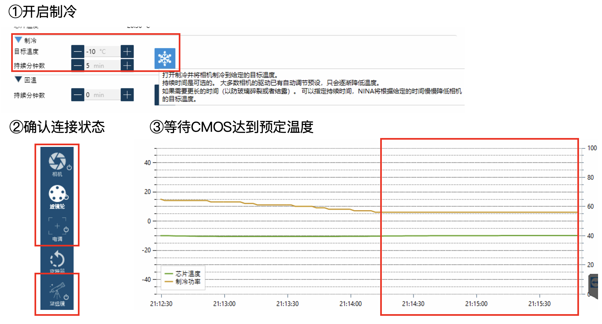{: .small}

* 制冷时持续分钟数不可太小，以防玻璃碎裂或者结露。
* 确认滤镜轮、电调、望远镜的连接状态。
* 到达目标温度后，最好等制冷稳定一段时间。

2、解除望远镜停放，打开“平场助手”，将望远镜指向天顶

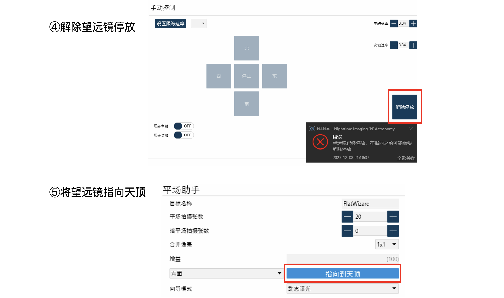{: .small}

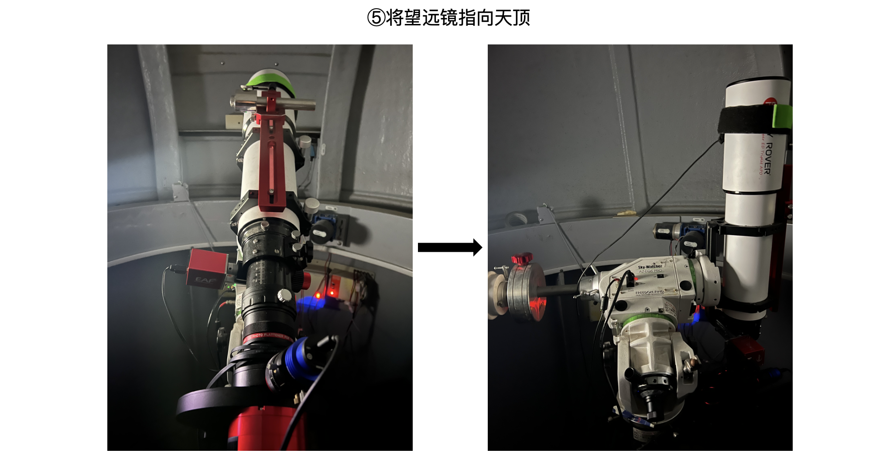{: .small}

3、检查平场板是否有灰，将平场板盖在望远镜上。

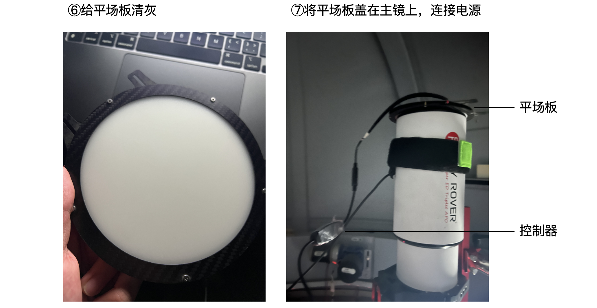{: .small}

* 注意平场板上是否有灰，需要将灰尘清除；
* 注意平场板边缘是否有减光，如果有需要避免；
* 总之保证主镜对着的部分亮度是均匀的。

4、打开平场板，调整平场板亮度。

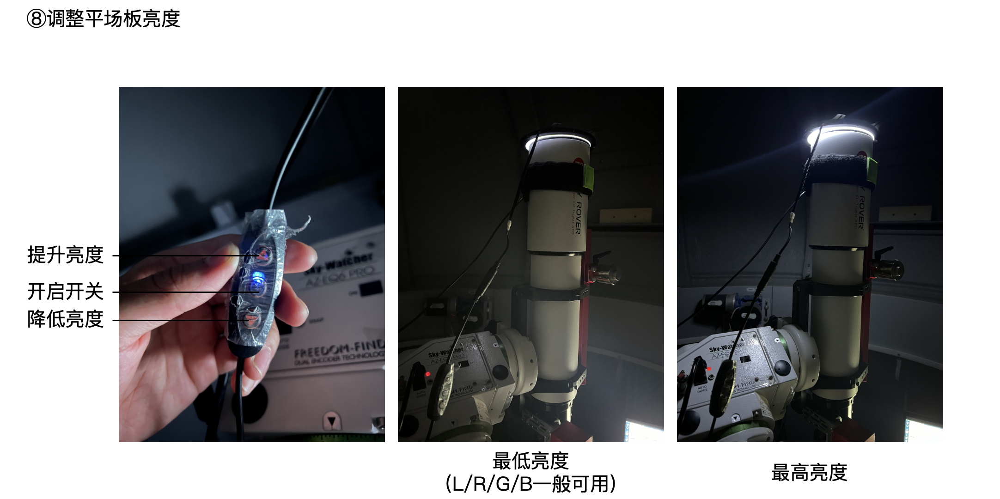{: .small}

* 对于L/R/G/B这种宽带滤镜，亮度一般调节到最低亮度。
* 对于Ha/OIII/SII这种窄带滤镜，亮度一般调节到较高亮度或者最高亮度（图中所用的是3nm的滤镜），这样可以缩短单张曝光时间至1秒或者几秒。

5、选择拍摄模式。

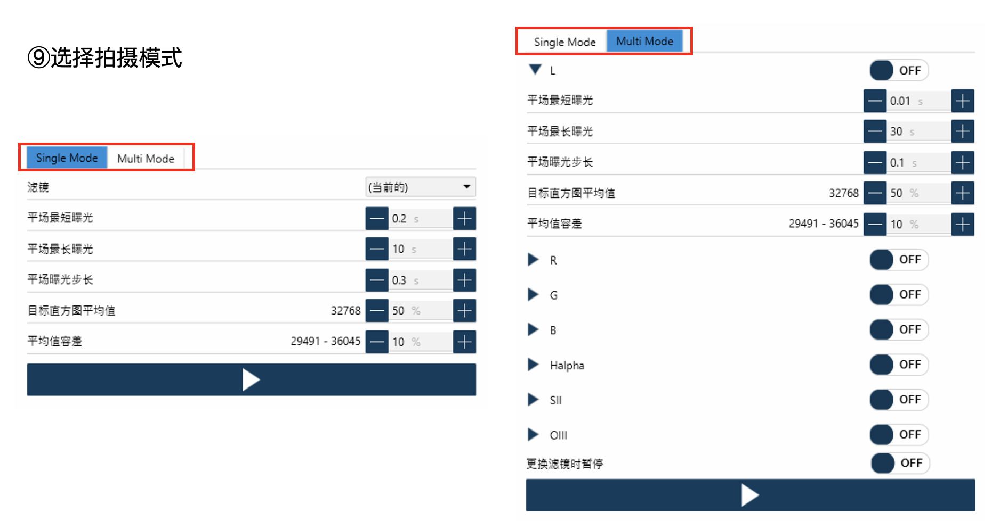{: .small}

* Single mode一般用于对于每种滤镜分别进行平场拍摄，我一般使用这个；
* Multi mode其实也没啥区别。只是把各个滤镜都列出来了而已。

6、设置参数，进行拍摄。

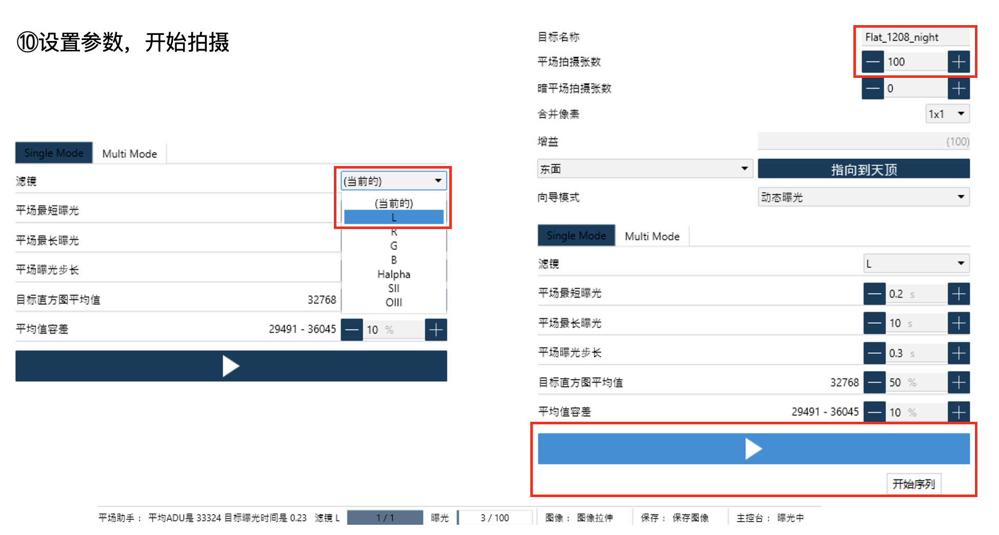{: .small}

* 选择滤镜；
* 按照实际情况，设置目标名称，最好能加上目标编号和目标拍摄时间；
* 设置平场拍摄张数。一般根据单张的曝光时间估计。我一般一个通道总计曝光时间在60s左右，所以对于Ha这种单张2秒的平场，我会设置30-40张。
* 暗平场：一般不需要。如果需要非常精确的校准，也可以选择拍摄暗平场。
* 向导模式：一般选择动态曝光即可。动态曝光会根据实际情况测算曝光时间。
* 平场最短曝光时间与平场最长曝光时间：设置平场曝光时间的范围。测算时会在这个范围内进行搜索。
* 平场曝光步长：搜索最佳曝光时间时的搜索步长。
* 目标直方图平均值：设置拍摄平场的目标平均值。
* 平均值容差：设置拍摄平场的目标值的范围。只有平场的目标值在这个范围内，对应的曝光时间才能被选中。

开始拍摄后，右侧会显示拍摄出的平场图像。

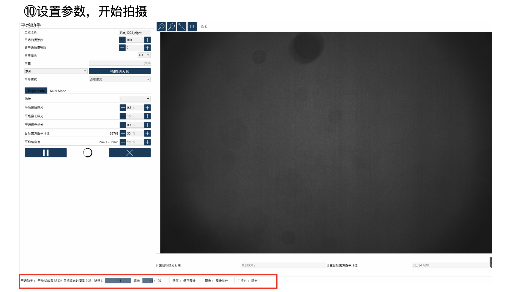{: .small}

也可以返回相机界面，注意观察制冷状况。在高速拍摄时很可能出现温度波动或者达不到目标温度的“温飘”现象，如果出现需要及时停止，以防温度与亮场差距过大导致校准出问题。

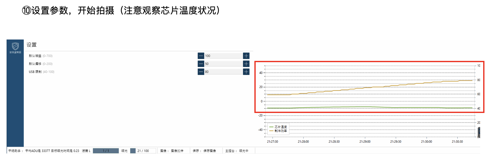{: .small}

7、依次对各个滤镜进行平场拍摄。如果出现曝光时间计算失败问题，尝试调节“平场曝光步长”、“平均值容差”等参数，或者调节平场板亮度。

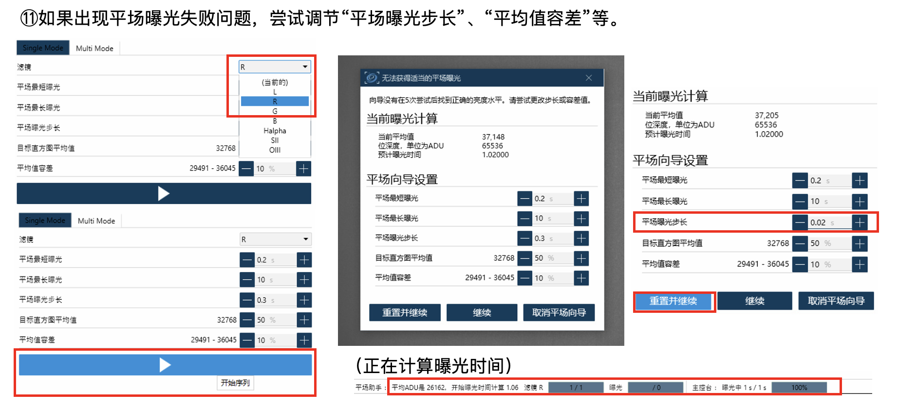{: .small}

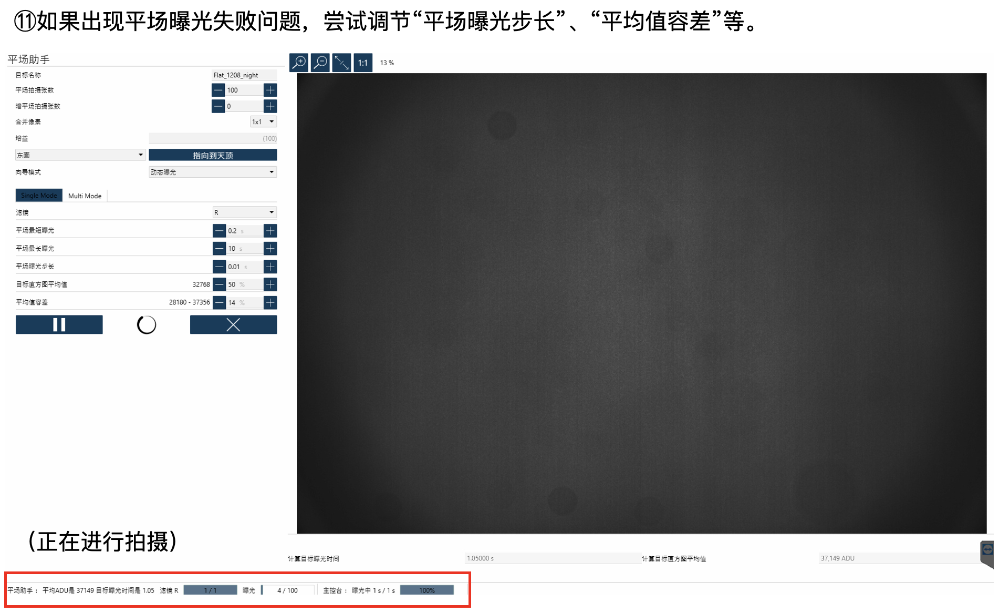{: .small}