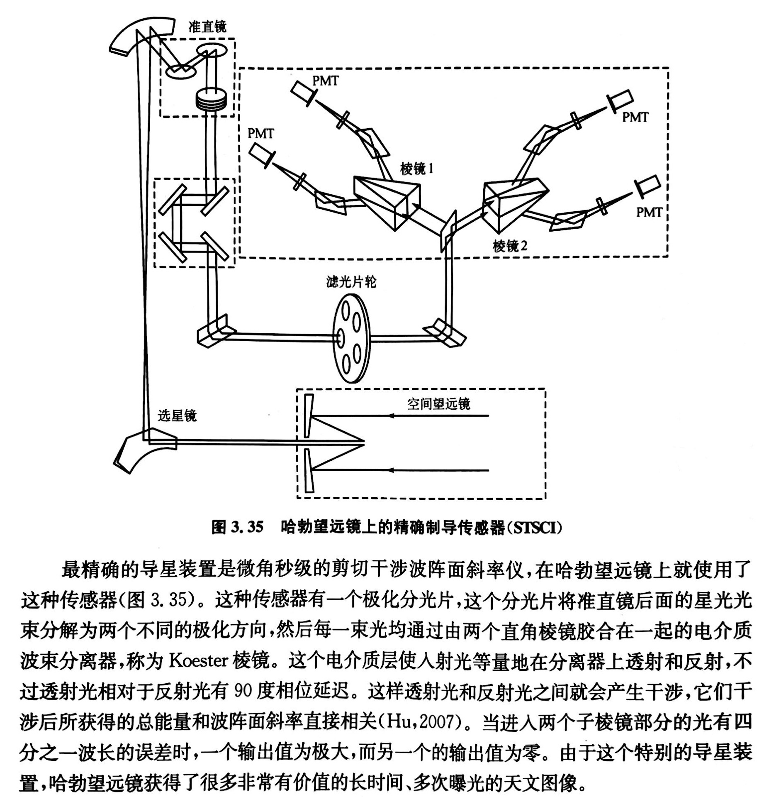
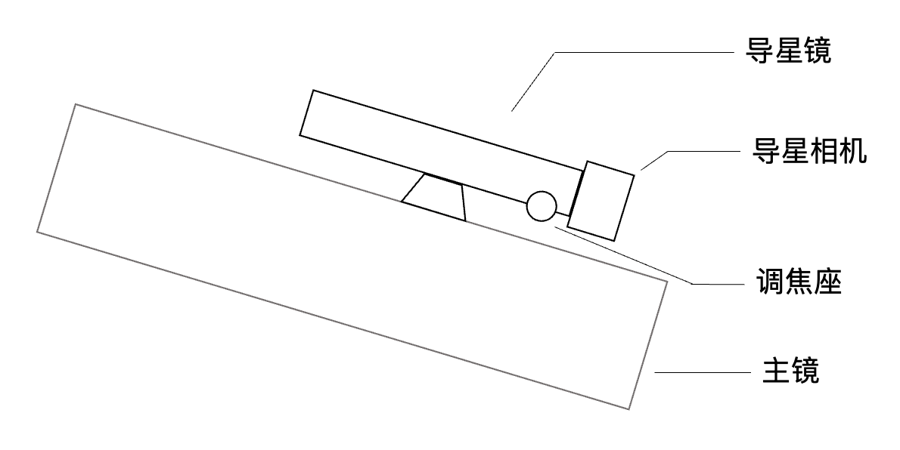

# 第一节 导星修正系统及其分类

## 1.1 导星的作用及意义

光学望远镜的基本要求是，要具有极高的指向和跟踪精度，特别是在长时间曝光的情况下。如果不使用导星，望远镜的跟踪系统最多也就能实现编码器分辨率所决定的指向和跟踪精度。这其实仍然属于开环系统，而开环系统能够实现的精度是非常有限的。因此，我们可以利用视场中的星点作为参考，实现控制环的闭合。

!!! note "基本概念"
    - 开环系统：系统输出量对系统输入量没有影响。
    - 闭环系统：通过传感器对输出量测量值的反馈来影响输入量。
    - 指向精度：是指望远镜从其他位置指向特定天体的准确程度。比如，为了测试指向精度，可以选择若干个待测试的亮星，使用控制系统控制望远镜Goto（指向）这些亮星，计算望远镜实际的指向位置与亮星在天球上的实际位置之间的偏差。
    - 指向误差：望远镜指示位置和天体实际位置的误差。产生指向误差的原因包括大气折射、望远镜制造和装配的误差、望远镜结构的重力变形、望远镜因为温度变化或者温度梯度引起的误差等等。大部分均有重复性的特点，可以利用误差修正模型来校正。当然，也有很多随机因素，比如空程误差以及一些其他的齿隙结构中的迟滞效应。但是，至少这些具体规律是可以明确的，最多是个函数优化问题。
    - 跟踪精度：是指望远镜在一定时间范围内持续跟踪天体的准确程度。比如，为了测试跟踪精度，可以先将恒星放在望远镜视场中心，在不开启导星的情况下，记录一定时间段内恒星移动的偏差，从而计算1s内亮星移动的角距离。
    - 跟踪误差：在一定范围内偏离目标星的残余指向误差。

这时，我们所利用的视场中的星点就是引导星。 **有引导星的跟踪称为导星。** 在导星时，能够自动保持引导星位置不变，从而实现望远镜的视场运动和目标天体的运动完全同步。这样，我们就能够实现精确的指向以及长时间跟踪曝光，同时保证星点的圆润。如果我没记错的话，国内有大佬做到了一小时单张曝光，且星点大小控制在2角秒以下。

!!! info "关于伺服控制"
    即使编码器能够利用闭环控制修正一定误差，但是这个闭环信息并不是来自星光本身，所以仍然是个开环系统。

## 1.2 导星的分类

早期的导星是手动导星。观测者通过和主望远镜（照相望远镜）平行的目视望远镜（也称导星镜），目视观测星点变化的同时，手动控制跟踪系统微调望远镜位置。

笔者没有经历过这样的时代，但是想想就很痛苦。想象一下，你必须在寒风中一动不动，眼睛一直盯着导星镜，用手不断微调。现在我们认真对个极轴就这么痛苦了，结果还要手动导星！有一说一，这还不是关键。一方面，你无法保证导星镜和主镜共轴，如果光轴偏差过大会带来很大的指向误差；另一方面，手动的精度肯定非常有限。

在介绍我们熟知的借助感光元件如CMOS之类的导星系统之前，其实还有很多别的光电导星装置：早期的四棱体反射镜式连续导星(continuous balance with pyramid reflector)、半圆片光通量调制导星装置、微秒级的剪切干涉波阵面斜率仪（用于哈勃望远镜）[^1]。具体的原理在这里就不展开了，在《天文望远镜原理与设计》一书中有详细的介绍，下图也来自于这本书：

{: .small}

对于我们业余爱好者，导星系统一般可以分为三类：

* **导星镜系统**
* **离轴导星系统**
* 同轴导星系统（我没见过）

### 1.2.1 导星镜系统

导星镜系统的原理其实很简单，和目视导星差不多，就是把人眼换成了CMOS/CCD（当然，焦距也比目视导星用的更短），通过主望远镜以外的另一个光学系统进行成像，实时观察星点的位置偏移量并反馈给控制系统进行补偿。组成也比较简单，通常由一个导星镜和一个导星相机构成。其中：

* 导星镜一般个头小，重量轻，焦距短（200-400mm居多），且焦比不能太慢（F/7以上就很麻烦）；
* 导星相机一般选择高灵敏度、量子效率高、低读出噪声的CMOS。

{: .small}

以下是对导星镜以及导星相机要求的解释：

* 导星镜：
    * 个头小：导星镜个头太大不利于设备的抗风；
    * 重量轻：首先，如果导星镜直接安装在主镜上，重量过重容易导致主镜变形；第二，如果不是远程台而是打野，导星镜重量过重不方便携带；第三，即使安装在云台上，重量过重也不利于整体的平衡和配重。
    * 焦比快：导星镜需要在短时间内得到足够的光通量，因此焦比要快，效率要高。F/6至F/4是比较常见的。
    * 焦距短：使用导星镜进行导星时，习惯上会使用较短的焦距。首先，较短的焦距前三个条件容易满足；其次，短焦时视场范围大，可选择的引导星多，不容易出现找不着星点的情况。但是也要考虑与主光学系统的匹配。按照经验值，焦距一般不能低于主镜的 $\frac{1}{4}$  至  $\frac{1}{3}$ 。

* 导星相机：
    * 高量子效率和低读出噪声：容易理解，这样的导星相机能够在短时间内获得高信噪比的导星图像，提高导星的稳定性和准确程度。
    * 高灵敏度：这里特指导星相机在红外波段的灵敏程度。在红外波段，星点受到视宁度的影响更小，这样大气抖动对于导星的影响就会更小。鸭哥曾经也做过一个实验，使用在红外波段的灵敏度高的CMOS进行红外导星或许有助于提高导星的精度[^2]。

因此导星镜和导星相机的要求其实不是很高，导星镜甚至用普消就可以，导星相机也没有必要用很高的帧率，USB2.0也够用。

关于设备推荐：我没有接广告！

* 导星镜：平民级的可以用cyck52-220ED，还有一些什么星缘的、裕众的都可以用。如果远程台或者预算充足，可以用一些裕众/锐星的ED或者APO进行导星，比如什么70apo之类的。总之要求不是很高，只要满足上面的条件即可。
* 导星相机：ZWO、QHY等都有专门的导星相机（ZWO把它归为mini版），比如290M、220MM。当然，用行星相机也是可以的，只要接口对了就行。一般导星相机选择黑白的比较好。重点是满足上面的要求。

一般而言，导星镜都是使用手动对焦，在导星前手动微调对焦即可。如果追求高精度，那么可以使用电动调焦器，实现远程控制以及自动对焦。

因此，导星镜系统的优点还是比较多的，可以简单归纳如下：

* 设备成本低，对于设备的要求不是很高，适用范围广；
* 装配和调试简单：作为独立于主成像系统的导星镜系统，不需要对主成像系统有额外要求。比如，如果相机使用的是日常摄影常用的单反或者微单来接驳望远镜，由于法兰距的适配问题并不方便使用其他的导星系统，这时导星镜是一个很不错的选择。在打野时，手动对导星镜进行快速对焦也非常方便。
* 能找到的引导星多，不会出现找不到引导星导致导星失败的情况。因为一般而言，导星镜的焦距都会比主镜更短，视场一般更大；还可以使用焦比更快的导星镜提高效率，获得信噪比非常不错的导星图像，进而提高导星系统的稳定性和准确度。

当然，导星镜系统也存在一些问题和不足。首先，导星镜的焦距很可能和主镜不一致，这样得到的导星图像和主镜拍摄的图像的视场、星点情况等都不一致，精度的上限可能不是很高。最关键的一点是，导星镜系统容易引起 **非同步形变** 的问题。

任何物体在受力后都会产生一定的形变，望远镜这类非理想刚体也不例外。导星镜和主镜的重量和结构都不完全一致，不同的位置和指向姿态下，两者的镜筒、抱箍、调焦座等结构产生的形变和形变方向都不完全一致（特别是某些镜子存在调焦座刚性不足的情况）。因此，导星镜和主镜的变形量和方向变化随时间不是同步的；随着拍摄的进行，很可能出现无法修正的非同步形变，这在长时间曝光情况下很容易出现“你导你的，我拍我的”的情况，使导星精度下降。

### 1.2.2 离轴导星系统

如何解决上述导星镜存在的问题？我们能想到的最简单的方法就是，假如我可以和主镜共用一个像场，“你用主镜拍摄，我也用主镜导星”，即使主镜存在形变那也是同步的，那不就不存在非同步形变的问题了？

具体做法是，在相机的感光元件以及镜筒之间，插入一个小棱镜，这个棱镜能够将主镜光路的一部分引到主光学系统之外，供导星相机成像。当然，为了不遮挡主相机进行成像，一般都是将靠近像场边缘、与主光轴有一定距离的部分拿过来给导星相机，所以叫做 **离轴导星系统或者偏轴导星系统** (off-axis guiding, OAG)。

## 参考资料

[^1]: 《天文望远镜原理和设计》程景全 南京大学出版社
[^2]: [红外导星解君愁——ASI462MM新用法 by 鸭哥](https://mp.weixin.qq.com/s/H2lK6-tn8YKj0nzEejBx8w)