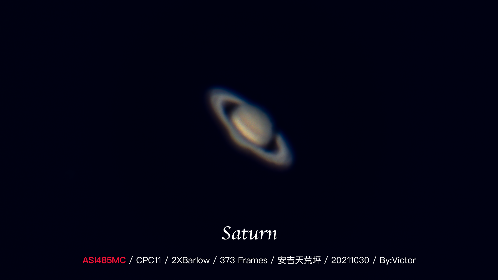
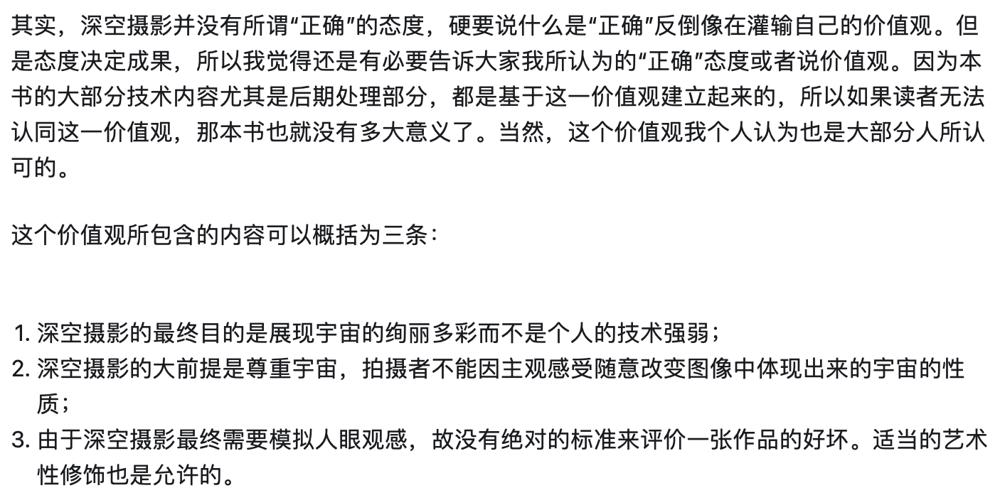

# 序言

!!! abstract "摘要"
    这是本书的序言部分，介绍了本书的主题——天文摄影的基本概念以及分类，以及本书的写作动机。

## 1 什么是天文摄影以及深空摄影？

### 1.1 天文摄影的概念及定义

以下是维基百科对于天文摄影的定义：

!!! note "天文攝影（摘自维基百科）"
    [天文攝影](https://zh.wikipedia.org/zh/天文攝影)（英語：Astrophotography）為一特殊的攝影技術，可記錄各種天體和天象，月球、行星甚至遙遠的深空天體。

维基百科的这段话已经很好地概括了天文摄影的概念，那么如何理解呢？

以我个人对于天文摄影粗浅的理解，天文摄影可以从以下几个方面来理解：

1. 从“天文”的角度来看，天文摄影是一种 **记录天体及天文现象的手段，是天文学及天文观测的重要组成部分** 。天文摄影有别于目视观测，它利用现代照相术的设备及技术方法，能够更加科学客观地观测并记录天体的形态、位置、亮度等信息。随着现代照相术的不断发展和飞速普及，近年来，天文摄影已经逐渐成为业余天文爱好的重要组成部分，也是天文学研究的重要手段之一。
    * 当然，“天文摄影”这一说法更多属于业余天文的范畴。在专业天文学中，我们口中的“天文摄影”更多局限于可见光波段的天文观测。也有天文爱好者自制射电望远镜，由于笔者了解不多，因此本书中不会涉及相关内容。
2. 从“摄影”的角度来看，天文摄影也可以看作是摄影领域的一个小分支，因为都是业余爱好者使用消费级相机设备、应用照相术进行影像记录的过程。因此，在某些基本的成像原理及艺术性的角度上，天文摄影与其他摄影（如风光摄影、人像摄影等）是相通的。但是，天文摄影与其他摄影有着非常大的区别，其中最关键的因素在于 **拍摄对象** 。
    * 对于其他摄影类别，信噪比都不是问题。换言之，绝大部分拍摄对象在短时间内（毫秒至几秒）发出或者反射的光信号都能轻松满足整个光学系统，不需要考虑信号被噪声淹没的问题（包括延时摄影，因为延时摄影只是将一段时间内的信息反映到一张图像而已）。
    * 但是，对于天文摄影而言，绝大部分拍摄对象发出或者反射的电磁波，都无法用肉眼直接看见。这里以暗弱的星云为例：它们有些可能不在可见光波段，有些需要跨越以光年为单位的距离并且受到大气层的扰乱后才能到达我们天文爱好者所在的地表。云层的遮挡自然不必说；这些信号在晴天的白天时，会被相对于其千百万倍的太阳光淹没；在晴朗的夜晚，还可能受到月光以及各种现代人工光源的干扰；最后才能到达我们的光学系统。因此，我们需要使用：
        * 聚光能力为我们肉眼成百上千倍的镜头（即望远镜）；
        * 高灵敏度的传感器；
        * 长时间的曝光（几十分钟至无穷）；
        * 科学的校准方法等等。
    
        才能 **将真正的天体信息如大浪淘沙般提取出来** 。当然，笔者刚刚举的例子属于深空摄影的范畴，对于其他天文摄影类别（比如行星摄影、日月摄影等）也有着些许不太一样的要求。但是事实上，总的来说，相对于其他的摄影类别，天文摄影的挑战性很多时候就在于这一点上。

??? note "那日月摄影呢？"
    你可能会觉得“太阳那么亮，看起来信噪比那么高，所以太阳摄影很简单”，我只能说不完全正确。如果你就想拍拍光球层，那确实，你甚至还要给整个光学系统减光；但是如果你要拍摄色球层（比如日珥），那这些信号的获取还是有难度的。平常色球层的信号都是被光球层淹没的；只有在日全食的时候，你才能比较容易看见色球层，比如太阳边缘那些红色的火焰就是日珥。如果你需要在平时观测日珥，那就需要使用专门的窄带滤镜（通常带宽需要在1Å以下），去除其他杂讯，只保留$H\alpha$处的信号来进行拍摄。此外，信号还是会受到大气层的干扰。因此从这个角度出发，日月摄影还是需要用相同的思路，即将所需的天体信息如大浪淘沙般提取出来。

以上仅仅是我对于如何理解天文摄影的一家之言。如果有需要补充的地方，欢迎留言。

### 1.2 天文摄影的分类

在上面介绍天文摄影的过程中，虽然只是说“天文摄影就是记录一些天体和天象”，但是就“天体和天象”这五个字，其实涵盖了非常多内容，甚至还有一些是未知的。因此，想要更加全面地了解天文摄影，我们还需要知道这五个字包含了哪些类别，也就是天文摄影的分类。

实际上，天文摄影按照对象再进行细分，又可以分为以下这些类别。笔者对这些类别简单概括如下：

* **星野摄影**：对象为非常广域的星空，通常会与风光（地景）及人像摄影结合。典型的包括银河、流星、极光、星轨等。是天文摄影中最贴近其他摄影类别的一类。
* **行星摄影（通常也会包含日月摄影）**：对象为太阳系内行星、日面、月面。典型的包括金星、木星、土星、太阳、月球等。
* **深空摄影**：对象为太阳系外的深空天体，典型的包括星云、星团、星系等。

!!! info "天文摄影的名词及分类"
    关于天文摄影的分类其实目前还没有十分标准的分类，以上类别仅仅是笔者本人的观点。另外，诸如“天文摄影”、“日月摄影”等名词其实也没有什么官方规定的叫法，比如“天文摄影”也可以叫成“星空摄影”，甚至“星野摄影”也指的是这个意思。因此，重点是理解不同的对象及类别。

本书将重点以 **深空摄影** 为例进行介绍。

## 2 为什么要写这本笔记？

!!! warning "注意"
    以下内容夹带私货！仅从我个人的角度出发，介绍我自己的想法罢了。

### 2.1 个人原因

我从小就对天文十分感兴趣。2011年12月10日那场月全食深深震撼了我。之后我就自己在家看了很多相关的天文类科普书籍，当时觉得相当有趣。自己家里还有一架天秤805，以前自己会跑去小山上看星星。高中时我本来想参加天文竞赛，但受限于自己所能获得的教学资源，没能参加 ~~（我并没有贬低我参加生竞的意思，我还是很爱生物的！）~~ 。高考结束差点打算去中山大学学天文。后来进入浙大后，我第一件事想到的就是加入浙大天协！当时本菜狗执着于加入学术，差点没去成

直到2021年10月，我基本都是以了解学习各种天文基础知识为主，比如学一些“太阳系天体有哪些”这种。之前的拍摄也仅限于星野摄影并且还很入门。

{: .small}

图1 我的第一张星野摄影照片-摄于天荒坪

但是，2021年10月我和天协的几个伙伴去了一次牵牛岗。那次我看到有很多人在路边架着望远镜，我好奇过去看了看，被他们实时拍摄的M31震撼到了，满脑子都是“すごい！すごい！（太厉害了）”，我心想，我也要拍这个！ ~~我也要成为深空摄影高手！~~

{: .small}

图2 那次去牵牛岗的自拍

然后我就正式入坑了深空摄影。我先从行星摄影开始，自己花钱买了个行星相机（ZWO ASI485MC），拍了月面、土星、木星、天王星等，然后试着拍了猎户座大星云M42（当然是短曝光叠加，随便试了试）。

{: .small}

图3 土星

.jpg){: .small}

图4 我的第一张M42

因为学校有个小圆顶，跟着大佬们，我逐渐开始熟悉起深空摄影，并越来越上头，甚至直接影响了我当时的科研方向。特别是在2022年，我花了很多时间自己组装设备拍摄或是操控小圆顶拍摄，拍了一些[渣图](../appendix/gallery.md)，在这期间边摸索、边零零散散学到了特别多东西，但是并没有一个比较细节的、比较系统的教程。其实在那时，我就已经有了整理一下自己脑子里零散知识的想法了，但是一直被各种事情搁置，只是写了一两篇零散的文章。

{: .small}

图5 IC1848 龙头上的小恶魔 摄于2022年12月

我个人觉得，整理的过程就是学习的过程，我也很希望让更多人能够对这个领域有所了解，因此作为一个十分业余的爱好者，我还是决定试着写一写，尝试把这个比较复杂的领域用比较科学、简单的语言写出来，记录自己的学习过程，帮助到更多和我一样的小白。

### 2.2 写作背景

近几年来，天文摄影在国内发展得相当迅速。在我入坑这短短的两年内（还不包括中间我摆烂的时间），我就看到了各种天文新器材层出不穷，并且天文后期从一开始需要使用一堆复杂的流程到现在AI一键反卷积/降噪。 ~~包括我自己都能入坑也能说明这玩意发展还是相当快的~~

但是，国内比较系统性的介绍天文摄影（本书说的更多是深空摄影）还是相当少的。我当时最早接触的是[百度天文吧](https://jump2.bdimg.com/f?kw=%E5%A4%A9%E6%96%87&ie=utf-8&tab=main)以及[巡星客](https://www.istarshooter.com/)，然后入坑深空后开始逛[牧夫论坛](https://bbs.imufu.cn/forum.php)，在学习期间还看到了[汞佬的教程](https://www.zhihu.com/column/HGAstronomyStudio)，写得相当好。当时对我帮助最大的是王为豪的《星野摄影（第二版）》以及《星野摄影（第三版）》。但是，我也想把自己的理解写出来，写自己是怎么从一无所知的小白到略知一二的小白的过程。再加上当今互联网发展相当快，天文摄影这种教程一年不更新都会多出很多东西，需要紧跟新版本。所以我有了把它放在Github上搞成开源项目的想法，这样 **无论是自主性（版本控制、自定义样式、多人合作等）还有可持续性（版本持续更新等）** 都比放在其它平台好得多。

??? question "关于网站名字"
    天文摄影对我而言，就是“听见星星的声音”、“给宇宙上色”，キラキラ（kirakira）的星空每次都能让我ドキドキ（dokidoki）(｡･ω･｡)，故取名kirastar（闪亮的星星）。

    著名cdd戸山香澄曾说：
    

## 3 对待天文摄影的态度以及对待本书的态度

### 3.1 对待天文摄影的态度

关于这一点，我其实也不想多提，每个人看待天文摄影（深空摄影）的视角不同，对待它的态度也就不尽相同，没有优劣好坏之分。但是我还是想引用一下汞佬在他的教程中提到的大部分人所认同的态度和价值观，也作为我所认同的、这本书的价值观：

!!! quote "深空摄影的正确态度"
    {: .small}

    图6 对待天文摄影（深空摄影）的态度[^1]

以及还有王为豪在《星野摄影（第三版）》中所提到的，所谓深空摄影就是展现赏心悦目并且科学准确的天体图像。并且天文摄影的目的是展现天文之美，供自己或他人欣赏，或者是用于科学分析。在埋头研究天文摄影技术、在电脑屏幕前处理天体图像的同时，也要时常自己抬头看看或是用望远镜目视星空。 **不能为星空所感动的人，他拍出的照片也是死的、也不会有说服力。** [^2]

### 3.2 对待本书的态度

坦率地说，我接触天文摄影的时间相当短，而我也并不是科班出身，仅仅是觉得这个领域很有趣，也很想通过这个过程进行自我学习（毕竟最好的学习方式就是“转述内容”），因此凭着“一腔热血”写了这些内容。所以我的角色充其量只是一个 **业余知识的搬运工** ，把相关的知识拿来拼接到一起，揉碎消化后用我自己的口吻表达出来。这些内容最多也就是个引导，想要真正深入学习，还得去参考各类理论书籍、文献等。

因此，我最希望的是读者在认真阅读后，能够以批判的眼光来看待这些内容，积极进行讨论和批评，对内容进行完善。这些内容一定有错误，而且结构体系一定有不合理之处，千万不能把它当作所谓“圣经”；能找出错误、指出不足，说出其中的道理，说明你已经有了自己独立的理解，这些内容也真正传达到了你的心里。

天文和天文摄影是科学，而不是玄学。科学之所以为科学，是因为它可以被客观事实证实或者证伪，背靠着基本的数理逻辑，是独立的而非依附的。盲目相信，或是追求一些永远正确的理论，只从想象、情绪、立场、道德上评价，而不是进行假设、实践、推理、验证，是不符合求是精神的表现。希望这些笔记也能够帮助你我，传承这种科学精神和求是精神，感受科学真正的魅力。

[^1]: [深空摄影完全攻略（1）（序言与概述） by 我可是汞](https://zhuanlan.zhihu.com/p/48044017)
[^2]: 王为豪 星野摄影（第三版）